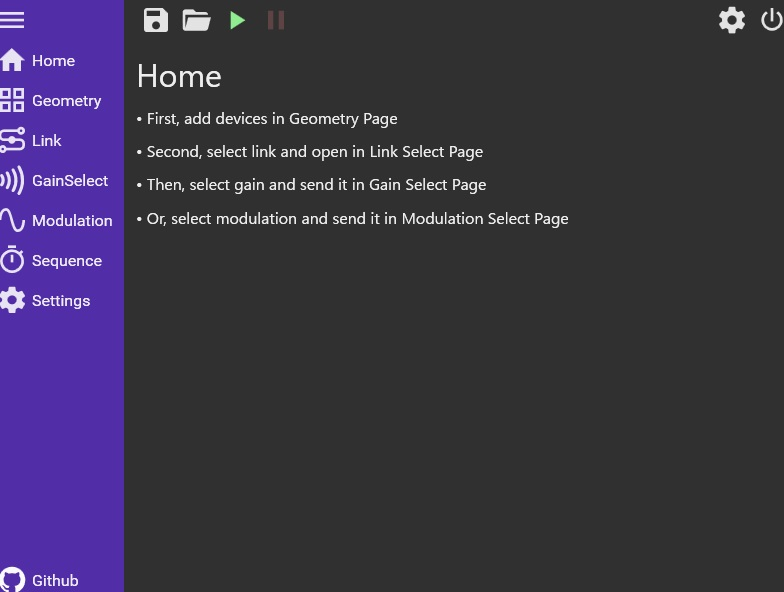

# GUI

<figure>
  
  <figcaption>GUI controller</figcaption>
</figure>

AUTDをGUIで操作して操作するためプログラムが[AUTD3 GUI Controller](https://github.com/shinolab/AUTD3-GUI-Controller)である.
C\#とWPFを使用して作られており, 現在はWindowsのみで動作する.

## Install

GitHubにコンパイル済みのバイナリがあるのでこれをダウンロードすれば良い.

## How to

AUTD3 GUI Controllerの起動後は上図のようなHome画面が表示される.
左側のタブから各種設定ができる.

### Geometry

GeometryタブではGeometryを定義する.
+ボタンでデバイスを追加し位置と回転を指定する.
ただし, クォータニオンによる指定はサポートしない.
また, Grouped Gainもサポートされていないので, Group IDの指定もない.
なお, ドラッグ&ドロップで順番を入れ替えられる.

### Link

Geometryを定義した後はLinkタブでLinkを選択し, Openボタンで接続する.

### Gain & Modulation

Linkを接続後はGain/ModulationタブでGain/Modulationを選択して, 右下の+ボタンでデバイスに送信する.

Grouped Gainはサポートされない.

### Sequence

Gain Sequenceはサポートされておらず, PointSequenceのみ使用可能になっている.

### Others

画面上部のファイルボタンで現在の設定を保存する.
その右のフォルダボタンで保存した設定を呼び出せる.
また, その右の緑色の三角のボタンでresume, その右の赤いポーズボタンでpauseができる.

終了するには右上のボタンを押す.
なお, 終了時に現在の設定が自動保存され, 次回起動時に復元される.
